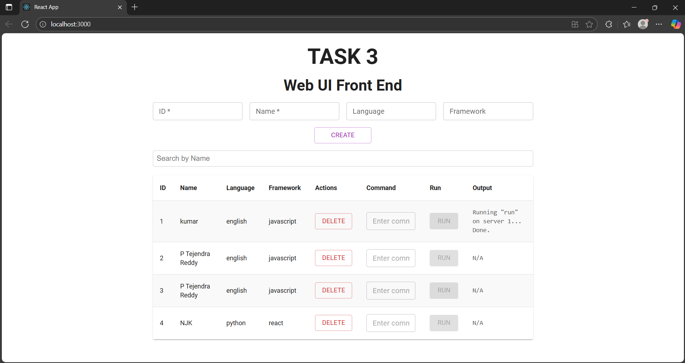
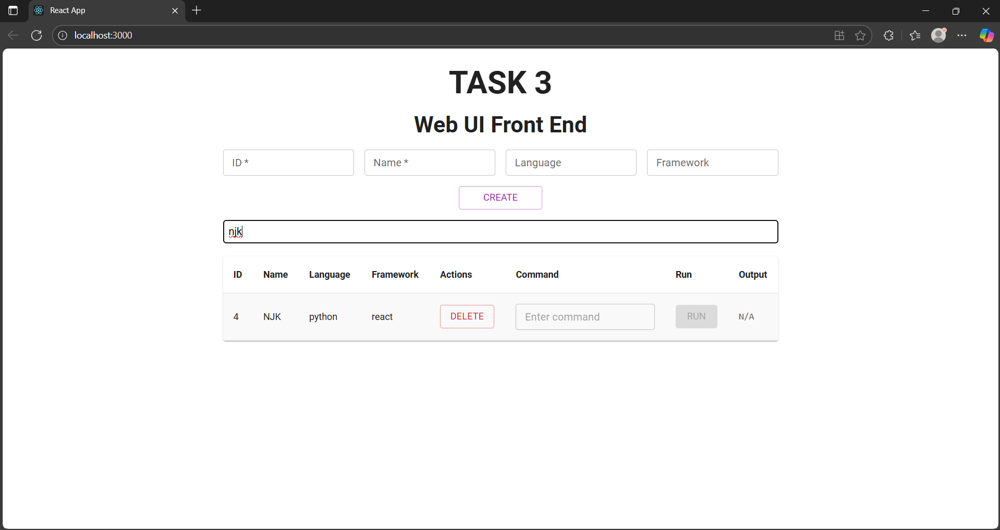
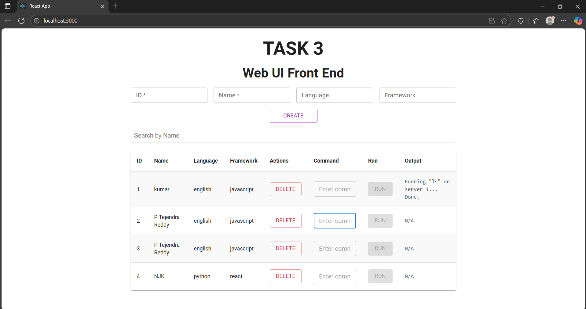

# 🌐 Task 3: Web UI – ServerOps Frontend

Task 3 is the frontend part of a full-stack project built using **React**. It complements the backend REST API developed in **Task 1 (Spring Boot)** by providing a modern, user-friendly interface to manage server data (stored in MongoDB).

---

## 📖 Table of Contents

- [🚀 Overview](#-overview)
- [✨ Features](#-features)
- [🛠️ Tech Stack](#-tech-stack)
- [📂 Project Structure](#-project-structure)
- [✅ Prerequisites](#-prerequisites)
- [⚙️ Getting Started](#-getting-started)
- [🌍 Running the App](#-running-the-app)
- [🔗 Backend API Info](#-backend-api-info)

---

## 🚀 Overview

This project builds a simple yet interactive frontend dashboard where users can:

- ➕ Add new servers with specific details  
- 📄 View all registered servers  
- ❌ Delete individual servers  

The frontend communicates with a **Spring Boot** backend (`http://localhost:8081`) that handles server-side logic and MongoDB persistence.

---

## ✨ Features

- 🧩 Component-based UI using **React** and **Material-UI**
- ➕ Create new server entries via form input
- ❌ Delete existing servers from the list
- 🔍 Real-time name-based search filtering
- 🌐 Integrated with RESTful backend API

---

## 🛠️ Tech Stack

| Technology      | Role                            |
|-----------------|---------------------------------|
| React           | Frontend framework              |
| Material-UI (MUI)| Styling and layout             |
| JavaScript (ES6)| App logic and UI interactions   |
| Fetch API       | HTTP requests to the backend    |
| Spring Boot     | Backend (from Task 1)           |
| MongoDB         | Database for storing server data|

---

Task-3-Web-UI/
├── public/
├── src/
│ ├── components/
│ │ ├── Header.js
│ │ ├── ServerForm.js
│ │ └── ServerList.js
│ ├── App.js
│ └── index.js
├── package.json
└── README.md

---

## ✅ Prerequisites

Ensure the following are installed on your system:

- [Node.js](https://nodejs.org/) (v14 or higher recommended)
- npm (comes with Node.js)
- A Spring Boot backend running at `http://localhost:8081` (from Task 1)

---

## ⚙️ Getting Started

### 1. Clone the repository

bash
git clone <repository-url>
2. Navigate to the project directory
bash
Copy code
cd Task-3-Web-UI
3. Install frontend dependencies
bash
Copy code
npm install
🌍 Running the App
4. Start the React development server
bash
Copy code
npm start
5. Access the frontend in your browser:
text
Copy code
http://localhost:3000
⚠️ Important:
Make sure the backend Spring Boot application is already running at:

text
Copy code
http://localhost:8081
If the backend isn't running, the frontend will not be able to fetch, add, or delete any server data.

## Screenshots

### Create Server Inserting Data

### Server List after Creating a Server

)
